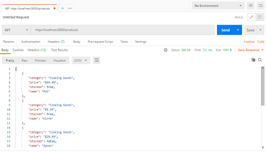
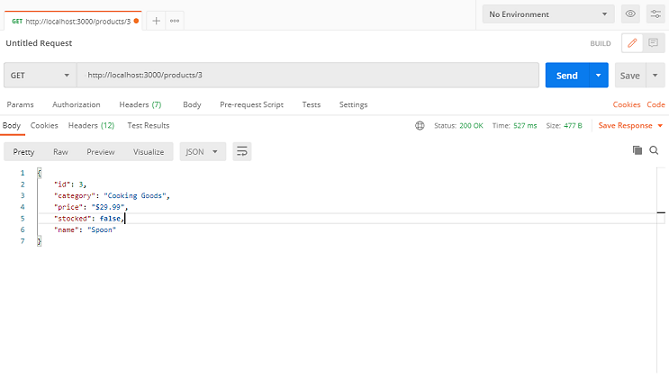
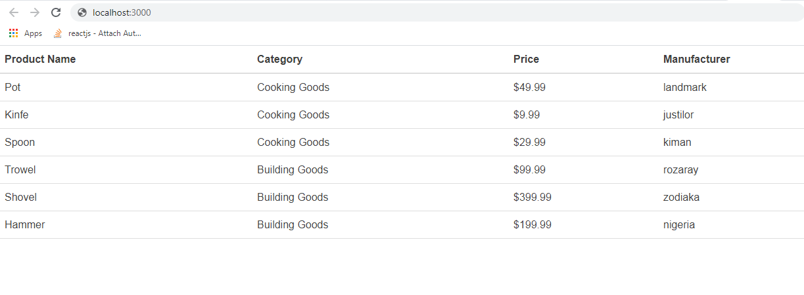

# Introduction

As a frontend developer, often you get frustrated when development is delayed due to lack of an actual API. It could be because the backend team taking too much time to create the endpoint the application is to consume or it could be due to technical issues related to the endpoint call. 

When you find yourself in this kind of situation, it is advisable to create your own mock API endpoints using a local JSON file so as to accelerate development and also save yourself from having to wait for the backend guys to get you what you need. 

This tutorial provides a step by step guide on how to create a react-app and setup a Mock API which can be consumed as though you’re making a backend call.
<!-- more -->

This guide assumes that you have a basic understanding of APIs and at least beginner proficiency working with JSON files and Node.js. 

You should also be familiar with testing APIs using either CURL or Postman for testing.

We are going to create a single page application that displays a table of products fetched from our Mock API. And we will be testing our Mock API endpoints using curl and postman as mentioned above. 

# Creating Mock API

Imagine that we want display a table of products coming from an API. The mock API endpoint could be */products* and the properties for each product will consist of:

- Id - A number that uniquely identifies the product
- Name – The name of the product
- Category- The category the product belongs to
- Price – The price of the product 
- Stocked – A Boolean value indicating if the product is in stuck or not (i.e true or false)

# Setup React App
This code creates a react App named “MockAPI” and starts the react server.

```bash
npx create-react-app MockAPI
cd MockAPI
npm start
```


Next we are going to setup the mock API, you are going to use a tool called JSON server. The tool is designed to help developers spin up REST APIs with CRUD functionalities very quickly.

# Creating the Mock API

First we are going to install ***json-server***.

```bash
npm install –g json-server 
```

Now let’s create a folder **mock-api-source** and then within it, create a *db.json* file. Your file structure should look something like this:

    MockAPI /    
        node_modules/
        src/
            mock-api-source/
                db.json
            index.js
        package.json

The ***db.json*** file will act as your data source. There, you will define what data you want to retrieve from your mock API. This is where you define the sample products and their various details as outlined earlier. The first property, "products", on the JSON file is used to define the name of the endpoint.
```json
    {
        "products": [
        {
            "category": "Cooking Goods", 
            "price": "$49.99",
             "manufacturer": "landmark", 
             "name": "Pot"
        },
        {
            "category": "Cooking Goods", 
            "price": "$9.99", 
             "manufacturer": "justilor", 
            "name": "Kinfe"
        },
        {
            "category": "Cooking Goods",
             "price": "$29.99", 
             "manufacturer": "kiman", 
             "name": "Spoon"
        },
        {
            "category": "Building Goods", 
            "price": "$99.99", 
             "manufacturer": "rozaray", 
            "name": "Trowel"
        },
        {
            "category": "Building Goods",
             "price": "$399.99", 
             "manufacturer": "zodiaka", 
             "name": "Shovel"
        },
        {
            "category": "Building Goods", 
            "price": "$199.99", 
             "manufacturer": "nigeria", 
             "name": "Hammer"
        }
    ]
    }
    ```
To start up your API, run the command below in your terminal:

```bash
json-server --watch src/mock-api-source/db.json
```

You should see your API running with an endpoint,

```bash
$ json-server --watch src/mock-api-source/db.json

  \{^_^}/ hi!

  Loading src/mock-api-source/db.json
  Done

  Resources
  http://localhost:3000/products

  Home
  http://localhost:3000

  Type s + enter at any time to create a snapshot of the database
  Watching...
```
# Testing the Mock API

Go ahead and test your newly created endpoint on any API testing tool, such as Postman or CURL.

## Testing With curl

To make a GET request for all products, the API call will look something like this:

```bash
curl http://localhost:3000/products
```

To make a GET request for specific product, append the id of the product to the endpoint /products/3. API call will look something like this:

```bash
curl http://localhost:3000/products/3
```

## Testing With Postman

Launch the postman app and make a get request to fetch all products
 http://localhost:3000/products

The response should be as below. Note that it is an array with all the products.



To make a GET request for a specific product, append the id of the products to the endpoint http://localhost:3000/products/3.

The response should be as below. Note that it is an object with the specific product details of the product whose id is 3.



# Displaying Product List From Mock API

Now let's create the page to display our products list.  

-	We are going to make a get request from within our app as though we are calling the backend
-	Then we will display the returned data in a list

To make a request to our Mock-API we can use **axios** which is a personal favorite for asynchronous backend call. 
> Axios is a popular, promise-based HTTP client that sports an easy-to-use API   and can be used in both the browser and Node. js.

Or we could stick with the default JavaScript **fetch()**  method, either ways the end goal is the same. 

## Installing Axios
``` bash
npm install axios –save
```

Now open *index.js*   and enter the following lines of codes

```js
import React, { useState, useEffect } from "react";
import ReactDOM from 'react-dom';
import Axios from "axios";
import *as serviceWorker from './serviceWorker'

const App = () => {
    const [products, setProducts] = useState([]);

    // here we use axios to make a get request to our mock api
    const getAllProducts = async () => {
        await Axios.get(`http://localhost:3000/products`)
            .then(async (res) => {
                let products = await res.data;
                //update products state
                setProducts(products);
            })
            .catch((err) => {
                console.log(err);
            });
    }
    useEffect(() => {
        getAllProducts();
    }, [])
	
    return (
        <div>
            <table>
                <thead>
                    <tr>
                        <th>Product Name</th>
                        <th>Category</th>
                        <th>Price</th>
                        <th>Manufacturer</th>
                    </tr>
                </thead>
                <tbody>
                    {
                        products.map(
                            (product, index) => {
                                return (
                                    <tr key={index}>
                                        <td>{product.name}</td>
                                        <td>{product.category}</td>
                                        <td>{product.price}</td>
                                        <td>{product.manufacturer}</td>
                                    </tr>
                                )
                            })}
                </tbody>
            </table>

        </div>
    )
}

ReactDOM.render(
    <BrowserRouter>
        <App />
    </BrowserRouter>,
    document.getElementById('root')
)
```
Now we are going to start the react server by running the command
```bash 
npm start 
```
You should see the following output on the console:

```bash
Local: http://localhost:3000
n Your Network:  http://172.20.10.2:3000
Note that the development build is not optimized. 
To create a production build, use npm run build.
```

Now that our server is up and running, launch your browser if it is not opened already and visit http://localhost:3000/




# Conclusion
We have now concluded how to create mock API or RESTful web service endpoints using json-server. This tutorial covered only GET requests. To further develop your skills and add to what you have learned so far in this guide, you can also learn how to use the json-server tool to develop endpoints with other methods like POST, PATCH, and DELETE. In addition, you can also add filtering and pagination to your endpoints.

I may come up with a more elaborated tutorial to cover this other topics in the nearest future. 


