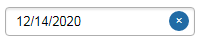
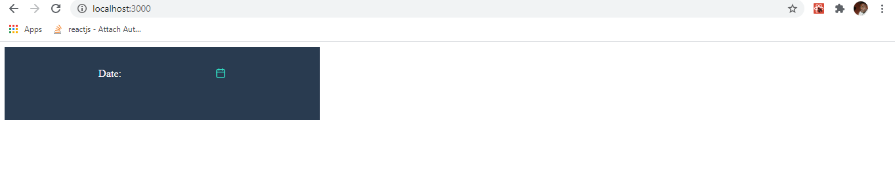
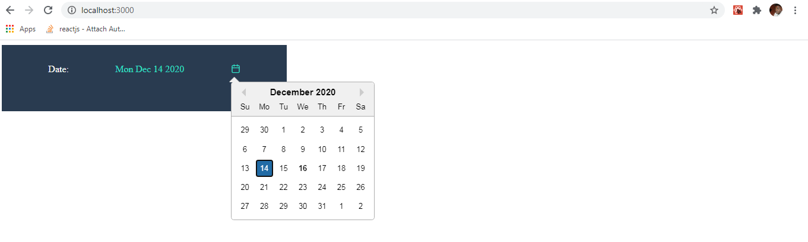

# Introduction

As a frontend developer UI UX design sometimes contain some feature that are not readily available out of the box in your chosen programming language, Frameworks or library. So you’re left with no choice than to improvise.

What do I mean by this? Observe the picture below 
.

If you observe very well, the calendar object is just a normal react-icon . 
The challenge here is, all the date picker library out there comes with a UI element which may not conform with the current design 
e.g., .
<!-- more -->

Now we have to find a way to change the default UI element that comes with the datePicker library to an Icon or Html tag that works for our project. Tweaking the default datepicker design to suit your need many times is a pain in the ass **Lol!*. 

After several hours of Google searching on how to customize the popular **react-datePicker* library UI element with no luck, I decided to take a look at the documentation.
There i discovered that the library actually accepts a React Component as part of it initializing props among other things. The React Component could be any **Html* tag that suit your design.

## Configuration ***react-datepicker*** 

You can use:
    - **selected** selected date 
    - **onChange** event handler which fires each time value of the selected Date changes
    - **onSelect** event handler which fires each time some calendar date has been selected 
    - **customInput** React Component to override default react-datepicker UI input Component

```js
<DatePicker
  selected={date} // selected date
  onSelect={handleDateSelect} //when day is clicked
  onChange={handleDateChange} //only when value has changed
  customInput={<Customised_Input_Component  /> } //customised datepicker UI Component
/>
```

In this tutorial i will show you how to customize **react-datePicker* Library to suit any UI design you’re working on. 

# Create a Customize UI Element for React datePicker

We will change the default **react-datePickre* UI element.
To a calendar icon  that can be used anywhere in the project to accept date input.

So basically what we are going to do is create a React Component that returns a Calendar icon. 

```js
const DatePickerCustomInput = (onClick) => <div className="calendar_icon"><FiCalendar onClick={onClick} /></div>);
```

This Component will then be passed to the Datepicker **customInput** props. by doing this we have overridden the default UI element of the **react-datePicker*

```js
<DatePicker
  ...
  customInput={<Customised_Input_Component  /> } //customised datepicker UI Component
/>
```
Let's install ***react-datepicker*** and ***react-icons*** library

```bash
npm install react-datepicker react-icons --save
```
Or via yarn:

```bash
yarn add react-datepicker react-icons
```

*Now let's Code, Shall we!*

```js
import React from "react";
import DatePicker from "react-datepicker"; //import reat-datepicker module
import "react-datepicker/dist/react-datepicker.css"; //import reat-datepicker css
import { FiCalendar } from "react-icons/fi";//import calendar icon from reat-icon 

const style = {
    display: "flex", 
    justifyContent: "space-evenly", 
    height: "5rem",
    width: "30rem",
    color: "#32e0c4",
    cursor: "pointer",
    background: "#293B50",
    paddingTop: "2rem"
}

/**
   * Customizing UI Component for the datepicker 
   * In this case i want to use a calendar icon as the date user interface
   * **NOTE onClick is passed to the component as props. 
   */
const DatePickerCustomInput = (onClick) => <div className="calendar_icon"><FiCalendar onClick={onClick} /></div>);

const ref = React.createRef(); // we need to add a Dom ref to the new Component to avoid Dom reffrence Error

const DatePickerCalendarIcon = () => {

    const [selectedDate, setSelectedDate] = useState("");

    // called when a user selects a date and upsate the "selectedDate" state
    const handleSelectedDate = (date) => {
        setSelectedDate(date);
    }
    return (
        <div className="datepicker-wrapper" style={style} >
           <span style={{color:"white"}}>Date:</span> {selectedDate ? selectedDate.toDateString() : "     "}
            <div className="datepicker" >
                <DatePicker
                    selected={selectedDate}
                    onChange={handleSelectedDate}
                    customInput={<DatePickerCustomInput ref={ref}/>}
                    dateFormat="yyyy/MM/dd" 
                />
            </div>
        </div>
    );
}

export default DatePickerCalendarIcon
```
# Conclusion

Now we have A simple and reusable datepicker component that can be thrown anywhere in our react project. 

**when you run the above code the output looks like this*




For more detailed example of react datePicker examples go to: [React datePicker official website](https://reactdatepicker.com/#example-calendar-open-state-callbacks)
