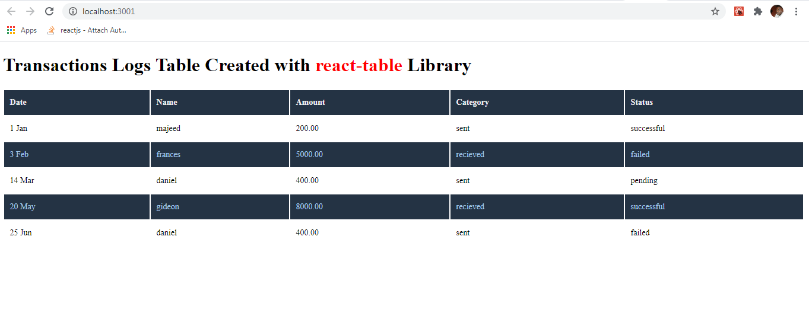
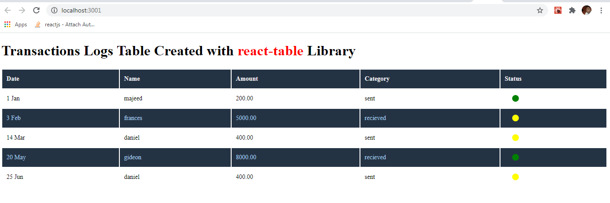

# Introduction

A Table is an essential building block of a user interface which is very critical for displaying data in a web, mobile or desktop App. Also referred to as data grid, a Table is an arrangement of data in rows and columns or in a more complex structure. 

The goal of every frontend developer is to create an intuitive user interface with data properly displayed regardless of screen size. Hence the importance of tables in UI UX cannot be over emphasized in software development as a whole. 
<!-- more -->

This guide is focused on using [*react-table*](https://www.npmjs.com/package/react-table) library to build a simple transactions history logs Table. After building our Table we will then proceed to spice it up with Filtering, Sorting and pagination functionality. Interestingly react-table is a lightweight, 100% customizable and fully controllable tool for building fast and extendable data grids for React. In React Table, you the developer are responsible for rendering the UI (markup and styles) of your table. The Library was created by Tanner Lesley, and is well documented [react-table.tanstack.com](https://react-table.tanstack.com/docs/quick-start).

This guide assumes that you are familiar with HTML table element, creating a Mock API, making API calls using axios and React Hooks. 

# Creating the Mock API

If you do not already know about Mock API, Set up the Mock API as explained in my previous guide, [How to create a Mock API in React](https://jidsfotech.github.io/codesmartly/Mock-API-in-React/json-server/How-To-Create-a-Mock-API-in-React/).

Your data structure in *db.json* file should look like this for the purpose of this tutorial. 

*db.json* 

```json
{
    "transactionLogs": [
    { 
        "category": "sent", 
        "amount": "200.00", 
        "user": "majeed", 
        "date": "2020-01-01",
        "status": "successful"
    },
    { 
        "category": "recieved", 
        "amount": "5000.00", 
        "user": "frances", 
        "date": "2020-02-03",
        "status": "failed"
     },
    { 
        "category": "sent", 
        "amount": "400.00", 
        "user": "daniel", 
        "date": "2020-03-14",
        "status": "pending"
    },

    { 
        "category": "recieved",
        "amount": "8000.00", 
        "user": "gideon", 
        "date": "2020-05-20",
        "status": "successful"
    },
    { 
        "category": "sent", 
        "amount": "400.00", 
        "user": "daniel", 
        "date": "2020-06-25",
        "status": "failed"
    },
    { 
        "category": "fail", 
        "amount": "2000.00", 
        "user": "gideon", 
        "date": "2020-08-17",
        "status": "pending"
    },
    { 
        "category": "sent", 
        "amount": "800.00", 
        "user": "mikel", 
        "date": "2020-07-25",
        "status": "failed"
    },
    { 
        "category": "fail", 
        "amount": "9000.00", 
        "user": "yankee", 
        "date": "2020-09-13",
        "status": "pending"
    }
]
}

```
Now start the API server by running this command: 

```bash
 json-server --watch src/reactTable/db.json
```
The mock-server should be up and running on 

```bash
http://localhost:3000/transactionLogs
```
As mention earlier this guide assumes that you’re familiar with the basics of working with react, so I am just going to dive straight into the setup and move on.

# Setting Up the Transactions Log App

Run the Create-React-App, command to create a new React App:
```bash
npx create-react-app TransactionsLog
```
Now startup the App by running the command:
```bash
npm start 
```
Remember our Mock-API server is running on **port 3000* which is also the default port for React. So expect React server to complain of **port 3000* already in use. Simply press enter key and follow the prompt to start React Server on another port.

 ```bash
npm start

> client@0.1.0 start C:\Users\Majeed\Documents\GitsHubLocaWorkSpace\React-Examples\client
> react-scripts start

? Something is already running on port 3000.

Would you like to run the app on another port instead? (Y/n)
```
# Creating the Table

A typical table is made up of ***rows*** which contain ***columns.*** A table configurations can get far more complex with nested columns, sub rows, etc.  

React Table uses ***useTable*** hook which accepts ***column*** and ***data*** array object and returns a Table ***instance*** that contains everything you will need to build a table and interact with its state. This includes:
- Sorting
- Filtering
- Grouping
- Pagination  
- Columns

From *react-table official Doc*
> useTable at the very least needs to be provided with an object containing the memoized columns and data.
>

- ***column*** is an array of object, where each object is a key value pair representation of Table Column Header. 

- ***data*** is an array of object which contains rows to be displayed on the table.


## Define Columns For the Table
Now that we have some data coming from our mock-API, let's create a set of column definitions to pass into the useTable hook.

Create a file *Column.js*, here we will define our column structure (an array of objects that consists of: 

***Header*** - Table column header display string or JSX.
***accessor*** - key in ***data*** object

Both accessor and Header value can be a function.

*Column.js*
```js
import React from 'react'

export const columns = [
                {
                    Header: "Date",
                    accessor: "date",
                  },

                {
                    Header: "Name",
                    accessor: "user",
                },

                {
                    Header: "Amount",
                    accessor: "amount",
                },

                {
                    Header: "Category",
                    accessor: "category",
                },

                {
                    Header: "Status",
                    accessor: "status",
                    }
                }
            ]
```
We now have **data** to populate the Table coming from our mock API and a **Column** definition, it’s time to create our Table. 

Creating a basic Table in a React app is easy with react-table. Run the following command to install it:
```bash
npm install react-table
```

First lets create our Table component, create a file *TransactionsLogTable.js* place the following code inside the file. 

*TransactionsLogTable.js*
```js
import React, { useMemo } from "react";
import {
    useTable,
} from 'react-table';

const TransactionsLogTable = ({ columns, data }) => {
    data = useMemo(() => props.data, []);
    columns = useMemo(() => props.columns, []);
    const {
        getTableProps,
        getTableBodyProps,
        headerGroups,
        prepareRow,
        rows,
    } = useTable(
        {
            columns,
            data,
        }
    );
    return (
        <div>
            <table {...getTableProps()} className="TransactionsTable">
                <thead>
                    {headerGroups.map(headerGroup => (
                        <tr {...headerGroup.getHeaderGroupProps()}>
                            {headerGroup.headers.map(column => (
                                <th {...column.getHeaderProps()}>
                                    {column.render('Header')}
                                </th>
                            ))}
                        </tr>
                    ))}
                </thead>
                <tbody {...getTableBodyProps()} className="TransactionsTableBody">
                    {rows.map(row => {
                        prepareRow(row)
                        return (
                            <tr {...row.getRowProps()}>
                                {row.cells.map(cell => {
                                    return (
                                        <td {...cell.getCellProps()}>
                                            {cell.render("Cell")}
                                        </td>
                                    )
                                })}
                            </tr>
                        )
                    })}
                </tbody>
            </table>
        </div>
    );
}

export default TransactionsLogTable;
```
Above we imported the ***useTable*** Hook and defined our Table Component as ***TransactionsLogTable***. The Component will receive ***column*** and ***data*** from the props, which originate from those objects and arrays that we defined earlier.

Note that we memoized ***column*** and ***data*** object before passing them to ***useTable*** as emphasized in *react-table official Doc.*

> It's important that we're using React.useMemo here to ensure that our data isn't recreated on every render. If we didn't use React.useMemo, the table would think it was receiving new data on every render and attempt to recalculate a lot of logic every single time. Not cool!

The ***getTableProps*** and ***getTableBodyProps*** functions are passed to the Table from the *instance* returned by the *useTable* Hook. 

***please refer to the official react-table [Doc](https://react-table.tanstack.com/docs/quick-start) for more in-depth explanation on the built in functions***

Next Open the App.js file and replace the default content with the following:

*App.js* 
```js
import React, { useEffect, useState } from "react";
import TransactionsLogTable from "./TransactionsLogTable";
import { columns } from "./Columns";
import axios from "axios";
import "./App.css"

const App = () => {
    const [data, setData] = useState([])

    useEffect(() => {
        // here we are making an API call to our Mock API to retrieve transactions log data
        axios.get(`http://localhost:3000/transactionLogs`)
            .then((res) => {
                setData(res.data);
            }).catch((err) => {
                window.alert(err)
            })
    }
        , [])

    return (
        <div>
            < TransactionsLogTable columns={columns} data={data} />
        </div>
    )
}

export default App; 

```
Finally we imported ***column*** object from the *Column.js* file, ***TransactionsLogTable*** Component from *TransactionsLogTable.js* file and make an API call to our ***Mock-API*** using *axios* to retrieve of ***data***.

Then we returned our Table Component passing *column* and *data* to it as props.

We are now done with the basics of how to use React Table. 

## Styling the Table
Now let's add some styling to our Table to make it more appealing!.
Create a file *App.css* and add the following css style

```css
.TransactionsTable {
    width: 100%;
    text-align: left;
    font-size: 14px;
}

.TransactionsTable thead tr {
    background: #243344;
    line-height: 24px;
    color: #EDEEEF;
}

.TransactionsTable thead th {
    padding: 0.6rem;
}

.TransactionsTableBody tr:nth-of-type(even) {
    background: #243344;
    color: rgb(163, 201, 238)
}

.TransactionsTableBody tbody tr {
    border-radius: 10px;
}

.TransactionsTableBody td {
    padding: 0.6rem;
    line-height: 24px;
}
```
Now start the React Server if it's not already running. If you've followed the guide correctly your output should look like this:


## Customising Table Cell
In the introductory part of this guide, I did mention it that React Table is %100 customizable. We are going to Customize the **date** and **status** Column of our Table.

React Table 7 allows you to define custom look for each cell. We can do this in the definition for a given column. We can render any React Component. 

Open the ***Column.js*** file and modify it this way

```js
import React from 'react'

export const columns = [
                {
                    Header: "Date",
                    accessor: "date",
                    Cell: (cellProps) => {
                        let date = new Date(cellProps.value).toDateString();
                        let day = date.split(' ').["2"];
                        let month = date.split(' ').["1"]
                        if (day.charAt(0) === '0') {
                            day = day.charAt(1)
                        };
                        return day + " " + month;
                    },
                  },

                {
                    Header: "Name",
                    accessor: "user",
                },

                {
                    Header: "Amount",
                    accessor: "amount",
                },

                {
                    Header: "Category",
                    accessor: "category",
                },

                {
                    Header: "Status",
                    accessor: "status",
                    Cell: (cellProps) => {
                        switch (cellProps.value) {
                            case "pending":
                                return (<div className="transaction-status" style={{ background: "yellow" }}></div>);
                            case "faild":
                                return (<div className="transaction-status" style={{ background: "red" }}></div>);
                            case "successful":
                                return (<div className="transaction-status" style={{ background: "green" }}></div>);
                            default:
                                return (<div className="transaction-status" style={{ background: "yellow" }}></div>);
                        }
                    }
                }
            ]
```
Refresh the browser to see our changes, your output should look like this:


Now you can see that the **date** field is looking more readable and the **status** field uses color to indicate the status of each transaction instead of text. You can customize your Table Cell however you want.

We have successfully setup our React Table at the most basic level and customized some of the Table Cell to suit our need. 

In the next part of this simple guide we will add **Pagination** functionality to the Table.

<span style="color: blue;"> [ADD PAGINATION TO A REACT TABLE](https://jidsfotech.github.io/codesmartly/React/Javascript/How-to-Add-Pagination-Functionality-to-a-React-Table/) </span>
