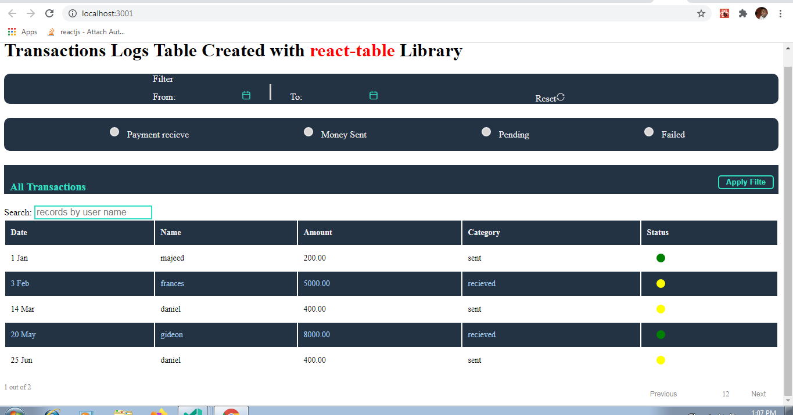

In the first two part of this guide, we
- [Setup a mock API](https://jidsfotech.github.io/codesmartly/Mock-API-in-React/json-server/How-To-Create-a-Mock-API-in-React/) - *we did this to simulate API call to a backend*

- [Setup React Table](https://jidsfotech.github.io/codesmartly/React/Javascript/How-To-Create-Dynamic-Tables-From-React-Table-v7/) - *we setup a react-table at the most basic level*

- [Implemented Table Pagination](https://jidsfotech.github.io/codesmartly/React/Javascript/How-To-Implement-Table-Pagination-React-Table-v7/) - *We implemented Pagination functionality for our table*

For clarity sake, if you're not already familiar with ***react-table*** it is recommended that you setup the Table by going through the previous guides respectively:

[How to Create Dynamic Tables From React Table v7](https://jidsfotech.github.io/codesmartly/React/Javascript/How-To-Create-Dynamic-Tables-From-React-Table-v7/)

[How To Implement Table Pagination React-Table v7](https://jidsfotech.github.io/codesmartly/React/Javascript/How-To-Implement-Table-Pagination-React-Table-v7/)

In this part, we will
- Create a [Date-Picker](https://jidsfotech.github.io/codesmartly/Javascript/ReactJs/How-To-Create-A-Date-Picker-Icon/) Component for Date Filtering

- Create a Component with several option buttons for the purpose Filtering Table by transactions *category*

- Create a Search Component for Filtering the Table base on the search value

- Implement React-Table Filter Hooks 
    - *useFilters* 
    - *useGlobalFilter*

<!-- more -->

## Create a Simple Reusable Datepicker Component 
We want to be able to filter our Table using date range, therefore we need to implement a DatePicker Component. The Component will do two basic things

- Set a Start-Date - *Start Filtering from this date*
- Set an End-Date - *To this date*

Let us start by installing *react-datepicker* library of course you can chose to use any Datepicker library you are most comfortable with. I chose *react-datepicker* because it is easy to customize and well documented. 

[Here is a Tutorial that explain in depth How to Create a reusable Date Picker by Customizing the ***react-datepicker*** library to suit your design needs](https://jidsfotech.github.io/codesmartly/Javascript/ReactJs/How-To-Create-A-Date-Picker-Icon/) 

Let us install ***react-datepicker*** and ***react-icons*** library

```bash
npm install react-datepicker react-icons --save
```
Or via yarn:

```bash
yarn add react-datepicker react-icons
```

Create a file and name it **DatePicker.js** 

```js
import React, { useState } from "react";
import DatePicker from "react-datepicker"; //import reat-datepicker module
import "react-datepicker/dist/react-datepicker.css"; //import reat-datepicker module css
import { FiCalendar } from "react-icons/fi";//import calendar icon from reat-icon 

/**
   * Customise input component for the datepicker 
   * replace the default date picker component with with a calendar icon
*/
const DatePickerCustomInput = React.forwardRef(
    ({ onClick }, ref) => (<div className="calendar_icon"><FiCalendar onClick={onClick} /></div>)
);

const ref = React.createRef(); // we need to add a Dom ref to the new Component to avoid Dom reffrence Error

const DatePickerCalendar = (props) => {
    return (
        <div className="datepicker" style={style} >
            <DatePicker
                selected={props.date}
                onChange={props.handleDateChange}
                customInput={<DatePickerCustomInput ref={ref} />}
                dateFormat="yyyy/MM/dd"
            />
        </div>
    );
}

const style = {
    display: "inline-block", 
    marginLeft: "6px",
    fontSize: "1em",
    color: "#32e0c4",
    cursor: "pointer"  
}
export default DatePickerCalendar
```

Now that we have our Datepicker Component setup, lets create a file that will house all our Filter implementations I named mine Filter.js. 

***Filter.js***
```js
import React, { useState } from "react";
import DatePicker from "./DatePickerCalendar"; //import the Datepicker Component we setup from DatePickerCallendar.js
import { AiOutlineSync, } from "react-icons/ai"; 
import { useAsyncDebounce } from 'react-table';


 const Filters = (props) => {

    const [startDate, setStartDate] = useState(null);
    const [endDate, setEndDate] = useState(null);
    const [categoryFilterValue, setCategoryFilterValue] = useState(null);
    const [value, setValue] = React.useState(props.globalFilter)
    const count = props.preGlobalFilteredRows.length;

    // attached to onChange event listener of Global filter input box
    const onChange = useAsyncDebounce(value => {
        props.setGlobalFilter(value || undefined)
    }, 200)

    //called when a user selects filter start-date 
    const handleStartDate = (date) => {
        setStartDate(date);
    }

    //called when a user selects filter end-date 
    const handleEndDate = (date) => {
        setEndDate(date);
    }

    // Hnadles Selected Category filter option and update the state  
    const handleCategoryOptionsChange = (event) => {
        setCategoryFilterValue(event.target.value);
    };

    // Auto Rest All Filters
    const autoResetFilter = () => {
        setStartDate(null);
        setEndDate(null);
        setCategoryFilterValue(null);
        props.dispatch({ type: "resetFilters" });
        var radios = document.querySelectorAll('input[name="category-Filters"]');
        for (let i of radios) {
            if (i.checked) {
                i.checked = false;
                break
            }
        }
    }

    // Filter table by selected category option
    const handleFilterByCategory = () => {
        props.setFilter("category", categoryFilterValue);
    }

    // Filter table by selected start-date and end-date
    const handleFilterByDate = () => {
        if (startDate && endDate) {
            props.setFilter("date", [startDate, endDate]);
        }
    }

    // Handles all calls to filter the table <-- attached to onClick event of "apply filter button" -->
    const applyFilter = () => {
        if (startDate && endDate && categoryFilterValue) {
            handleFilterByDate();
            handleFilterByCategory();
        }
        if (startDate && endDate && !categoryFilterValue) {
            handleFilterByDate();
        }
        if (!startDate && !endDate && categoryFilterValue) {
            handleFilterByCategory();
        }
        if (!startDate && endDate || startDate && !endDate) {
            window.alert("Please Make sure you select start-date and end-date");
        }
    }

    return (
        <div>

        {/** Datepicker and reset Button section */}
            <div className="filterParameters" id="filterParameters">
                <div className="datePickerWrapper">
                    <div className="Datepicker-grid-container">
                        <div>Filter </div>
                        <div className="startDate">From: <div className="datePickerLabel">{startDate ? startDate.toLocaleDateString("fr-CA") : null}</div>
                            < DatePicker handleDateChange={handleStartDate} date={startDate} />
                        </div>
                        <div className="verticalLine"></div>
                        <div className="endDate">To: <div className="datePickerLabel">{endDate ? endDate.toLocaleDateString("fr-CA") : null}</div>
                            < DatePicker handleDateChange={handleEndDate} date={endDate} />
                        </div>
                    </div>
                </div>
                <div className="resetFilter" onClick={autoResetFilter}><span>Reset</span>
                    <AiOutlineSync className="resetFilter_icon" />
                </div>
            </div>
            
            {/** Options Buttons for setting the filter by category value */}
            <div className="filterByCategoryOptions" id="filterByCategory">
                <div onChange={handleCategoryOptionsChange} className="filterBy-RecievedMoney">
                    <input type="radio" value="recieved" name="category-Filters" id="recievedMoney" />
                    <label htmlFor="recievedMoney">Payment recieve</label>
                </div>
                <div onChange={handleCategoryOptionsChange} className="filterBy-moneySent">
                    <input type="radio" value="sent" name="category-Filters" id="moneySent" />
                    <label htmlFor="moneySent">Money Sent</label>
                </div>
                <div onChange={handleCategoryOptionsChange} className="filterBy-pendingTran">
                    <input type="radio" value="pending" name="category-Filters" id="pendingTran" />
                    <label htmlFor="pendingTran">Pending</label>
                </div>
                <div onChange={handleCategoryOptionsChange} className="filterBy-failedTran">
                    <input type="radio" value="fail" name="category-Filters" id="failedTran" />
                    <label htmlFor="failedTran">Failed</label>
                </div>
            </div>
            <div className="apply-filter">
                <h3>All Transactions</h3>
                <button onClick={applyFilter} className="applyFilter-btn" id="applyFilter-btn"> Apply Filte </button>
            </div>

            {/** Search input box for Filtering the Table base on "search text"*/}
            <span className="globalFilterInput" >
                Search:{' '}
                <input
                    type="text"
                    value={value || ""}
                    onChange={e => {
                        setValue(e.target.value);
                        onChange(e.target.value);
                    }}
                    placeholder={`records by user name`}
                    style={{
                        fontSize: '1rem',
                        border: '2px solid #32E0C4',
                        }}
>
                </input>
            </span>
        </div >
    )
}

export default Filters;
```
So far here is what we have done

- we imported the Datepicker Component that was created earlier from **DatePickerCalendar.js** and use it to update ***startDate*** and ***endDate*** as the selected Date value changes.

- created a group of option buttons that will be used to filter the Table when an option is selected. The option button **onChange** event listener triggers and updates the ***filterByCategory*** state variable. 

- Created a Search Bar, the input box **onChange** even listener is attached to a function that sets filter value by calling ***setGlobalFilter(colunmName, filterValue)*** 
  

- created a filter button that is clicked to apply filter. The button **onClick** event listener is attached to a function that sets filter value by calling ***setFilter(colunmName, filterValue)*** 

Finally, we need to import the Filters Component inside the **TransactionsLogTable.js** file where it will be used.

Open ***TransactionsLogTable.js*** File
```js
import React, { useMemo , useAsyncDebounce} from "react";
import TablePagination from "./Pagination"; // import TablePagination Component from our Pagination.js file
import Filters from "./Filters"; // import Filters Component from our Filters.js file
import {
    useTable,
    usePagination,
    useFilters,
    useGlobalFilter,
} from 'react-table'; // import react-table Hooks including useFilters and useGlobalFilter

const TransactionsLogTable = ({ columns, data }) => {

    const filterTypes = React.useMemo(() => ({
        dateFilter: (rows, id, filterValue) => {
            return rows = rows.filter(row => {
                return new Date(row.values.date) >= filterValue[0] && new Date(row.values.date) <= filterValue[1];
            });
        },
    }),
        []
    )
    const {
        getTableProps,
        getTableBodyProps,
        headerGroups,
        prepareRow,
        page,
        canPreviousPage,
        canNextPage,
        pageOptions,
        nextPage,
        previousPage,
        setGlobalFilter,
        preGlobalFilteredRows,
        setFilter,
        dispatch,
        state: { pageIndex, pageSize, globalFilter },
    } = useTable(
        {
            columns,
            data,
            initialState: { pageIndex: 0, pageSize: 5 },
            filterTypes,
        },
        useFilters,
        useGlobalFilter,
        usePagination
    );
    return (
        <div>
        {/** Filters Component */}
            < Filters
                setFilter={setFilter}
                preGlobalFilteredRows={preGlobalFilteredRows}
                globalFilter={globalFilter}
                setGlobalFilter={setGlobalFilter}
                dispatch={dispatch}
            />

            {/** Table Component */}
            <table {...getTableProps()} className="TransactionsTable">
                <thead>
                    {headerGroups.map(headerGroup => (
                        <tr {...headerGroup.getHeaderGroupProps()}>
                            {headerGroup.headers.map(column => (
                                <th {...column.getHeaderProps()}>
                                    {column.render('Header')}
                                </th>
                            ))}
                        </tr>
                    ))}
                </thead>
                <tbody {...getTableBodyProps()} className="TransactionsTableBody">
                    {page.map(row => {
                        prepareRow(row)
                        return (
                            <tr {...row.getRowProps()}>
                                {row.cells.map(cell => {
                                    return (
                                        <td {...cell.getCellProps()}>
                                            {cell.render("Cell")}
                                        </td>
                                    )
                                })}
                            </tr>
                        )
                    })}
                </tbody>
            </table>

            {/**Pagination Componenet*/}
            <TablePagination
                pageIndex={pageIndex}
                pageOptions={pageOptions}
                previousPage={previousPage}
                canPreviousPage={canPreviousPage}
                nextPage={nextPage}
                canNextPage={canNextPage}
            />
        </div>
    );
}

export default TransactionsLogTable;
```
We are done with the Filter Implementation, start the React server as usual 

```bash
npm start
```
    
if you have followed this guide judiciously the output should look like this. 


Feel free to ask any question as regards this guide in the comment section
