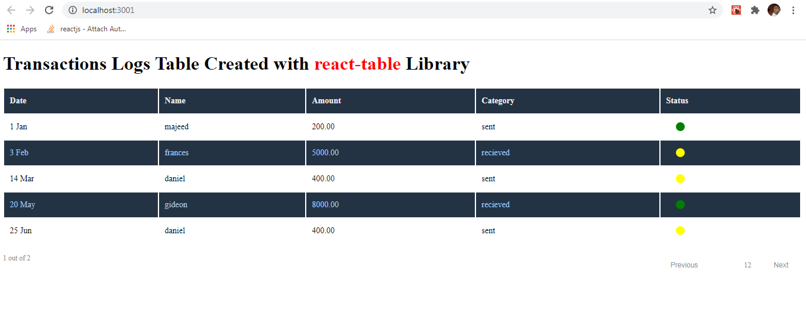

This guide is a build up from our previous guide: <span style="color: blue;"> [How To Create Dynamic Tables From React Table v7]( https://jidsfotech.github.io/codesmartly/React/Javascript/How-To-Create-Dynamic-Tables-From-React-Table-v7/) </span>


In the first part, we 
- [Setup a mock API](https://jidsfotech.github.io/codesmartly/Mock-API-in-React/json-server/How-To-Create-a-Mock-API-in-React/) - *we did this to simulate API call to a backend*

- [Setup React Table](https://jidsfotech.github.io/codesmartly/React/Javascript/How-To-Create-Dynamic-Tables-From-React-Table-v7/) - *we setup a react-table at the most basic level*
- Customized the Table **date** and **status** Column to make it more appealing - *we demonstrated how to customize individual Table Cells to suit our need*

For clarity sake, if you're not already familiar with ***react-table*** it is recommended that you setup the Table by going through the previous [guide]( https://jidsfotech.github.io/codesmartly/React/Javascript/How-To-Create-Dynamic-Tables-From-React-Table-v7/)  

In this part, we will
- Add a UI Pagination Component at the bottom of our table

- Implement  React-Table Pagination Hook *(usePagination)* functionality in the table 
<!-- more -->

# Pagination in **react-table** v7
In a bid to give developers % 100 controls over the Table UI design, React Table v7 by default does not provide a UI Component for Tables Pagination.
Rather it provides ***usePagination*** hook. **usePagination** is the hook that implements row pagination, which splits a large amount of data to pages and displays one page at a time.

## Create Pagination UI Component
 First let's design a simple UI Pagination Component for our Table. To achieve this, we will create a file inside *src* folder and name it whatever you want, I named mine *Pagination.js*

Inside *Pagination.js*, add the following code 
  ```js
  import React from "react";

const TablePagination = (props) => {
    return (
        <div className="TablePagination">
            <div className="table-pagesIndexing">{props.pageIndex + 1} out of {props.pageOptions.length}</div>
            <div className="navigationButtonsContainer">
                <button
                    onClick={props.previousPage}
                    disabled={!props.canPreviousPage}
                > Previous
                </button>
                <ul style={{ display: "flex" }}>
                    {
                        props.pageOptions.map((index, page) => {
                            let totalPages = props.pageOptions.length;
                            if (page + 1 > 5 && page + 1 < 10 && totalPages >= 10) {
                                return
                            }
                            if (page + 1 === 10) {
                                return <li key={index}>....{10}</li>
                            }
                            if (page + 1 > 10 && totalPages > 10) {
                                const numbersOFpagesAfter_Page_10 = props.pageOptions.slice(10);
                                if (numbersOFpagesAfter_Page_10.length > 3 && page + 1 === totalPages) {
                                    return <li key={index}>....{totalPages}</li>
                                }
                                if (numbersOFpagesAfter_Page_10.length > 3 && page + 1 <= 12) {
                                    return <li key={index}>{page + 1}</li>
                                }
                                if (numbersOFpagesAfter_Page_10.length > 3) {
                                    return
                                }
                                return <li key={index}>{page + 1}</li>
                            }
                            return <li key={index}>{page + 1}</li>
                        })}
                </ul>
                <button
                    onClick={
                        props.nextPage
                    }
                    disabled={!props.canNextPage}
                >Next
                </button>
            </div>
        </div>
    );
}

export default TablePagination;
```

## Add Pagination Component To the Table 

To add Pagination to our Table, we make the following changes:
- Import ***usePagination*** Hook
- Pass ***usePagination*** hook to ***useTable*** as props
- Destructuring of several additional props that we need to build our pagination.
    - *page*,
    - *canPreviousPage*,
    - *canNextPage*,
    - *pageOptions*,
    - *nextPage*,
    - *previousPage*,

- Define initial State in which we specify how many rows we want to display per page (pageSize) and from which page we start displaying (pageIndex).
    - *initialState: { pageIndex: 0, pageSize: 5 }*

Now let's refractor our code to include the following changes:

Open *TransactionsLogTable.js* File
```js
import React, { useMemo } from "react";
import TablePagination from "./Pagination" // import Pagination Component from Pagination.js
import {
    useTable,
    usePagination 
} from 'react-table'; // import useTable and usePagination Hooks from react-table

const TransactionsLogTable = ({ columns, data }) => {
    data = useMemo(() => props.data, []);
    columns = useMemo(() => props.columns, []);
    const {
        getTableProps,
        getTableBodyProps,
        headerGroups,
        prepareRow,
        
        // needed for pagination functionality
        page,
        canPreviousPage,
        canNextPage,
        pageOptions,
        nextPage,
        previousPage,
        state: { pageIndex, pageSize },
    } = useTable(
        {
            columns,
            data,
            initialState: { pageIndex: 0, pageSize: 4 } // dipslay 4 pages starting from index 0
        },
        usePagination // here we pass usePagination hook to useTable hook as props 
    );
    return (
        <div>
         {/** Table Component */}
            <table {...getTableProps()} className="TransactionsTable">
                <thead>
                    {headerGroups.map(headerGroup => (
                        <tr {...headerGroup.getHeaderGroupProps()}>
                            {headerGroup.headers.map(column => (
                                <th {...column.getHeaderProps()}>
                                    {column.render('Header')}
                                </th>
                            ))}
                        </tr>
                    ))}
                </thead>
                <tbody {...getTableBodyProps()} className="TransactionsTableBody">
                    {page.map(row => {
                        prepareRow(row)
                        return (
                            <tr {...row.getRowProps()}>
                                {row.cells.map(cell => {
                                    return (
                                        <td {...cell.getCellProps()}>
                                            {cell.render("Cell")}
                                        </td>
                                    )
                                })}
                            </tr>
                        )
                    })}
                </tbody>
            </table>
            
            {/**Pagination Component*/}
            <TablePagination
                pageIndex={pageIndex}
                pageOptions={pageOptions}
                previousPage={previousPage}
                canPreviousPage={canPreviousPage}
                nextPage={nextPage}
                canNextPage={canNextPage}
            />
        </div>
    );
}
export default TransactionsLogTable;
```
So far, we've created a Pagination Component, pass to it as props ***useTable*** Object options required for Table Pagination.
And that's it guys we are done with Adding Pagination functionality to our table for better readability.

When we start our app, you should see the pagination Component right under the table. 

